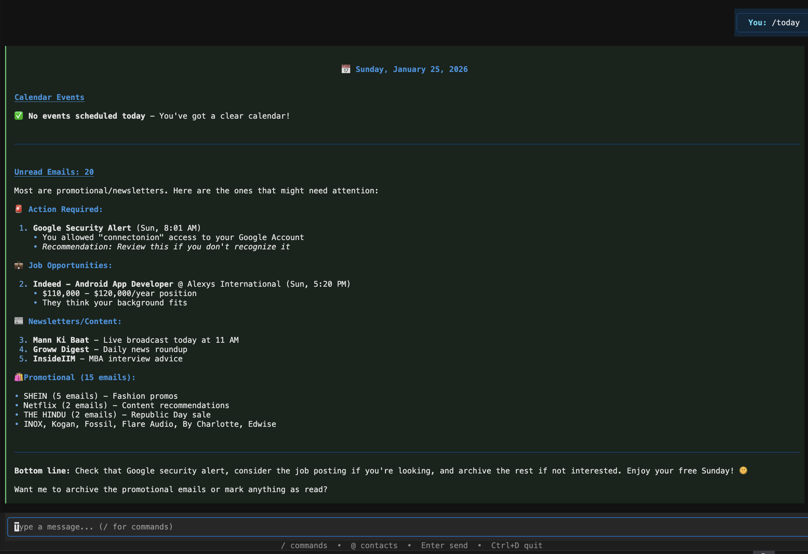
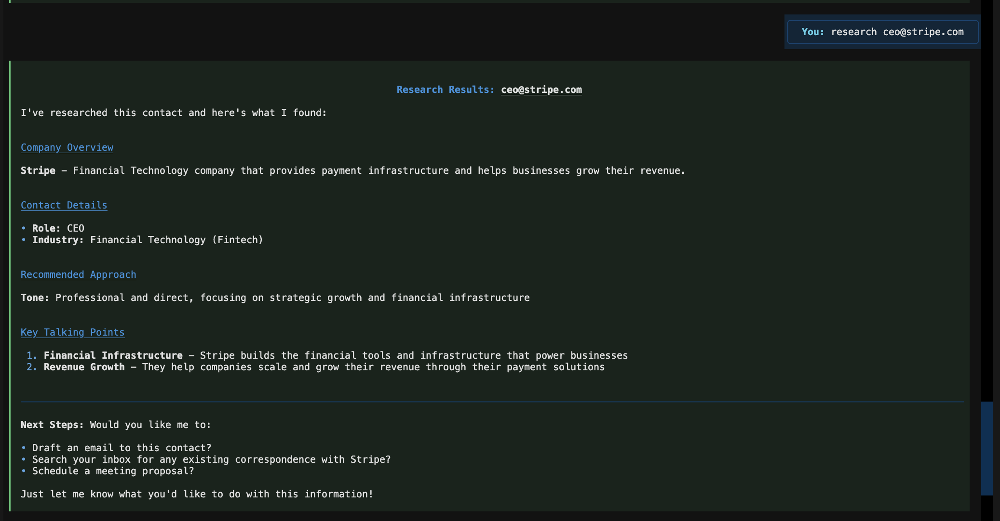
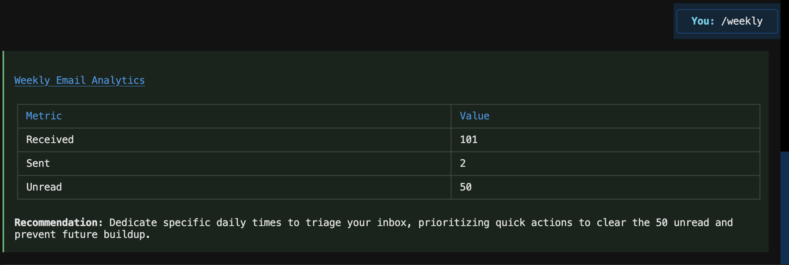
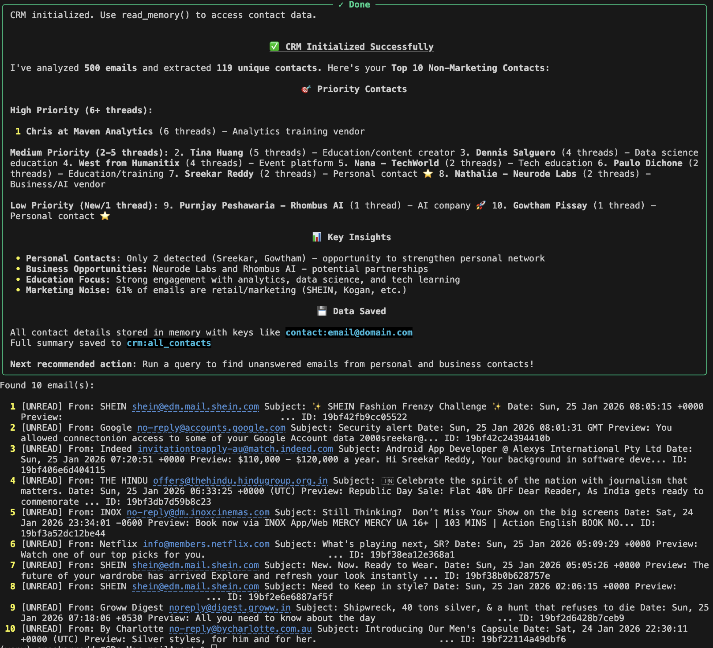
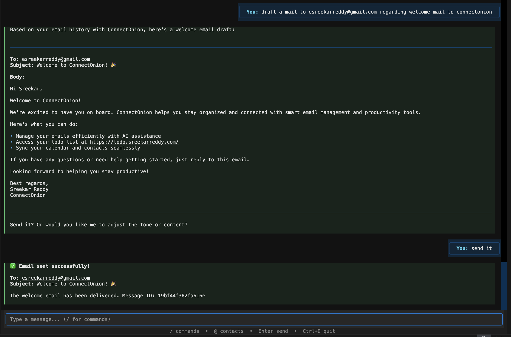
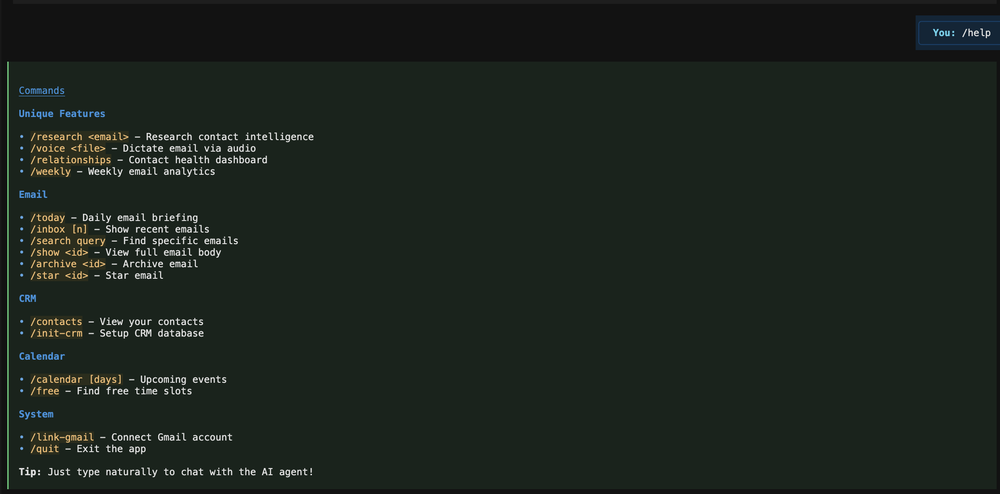
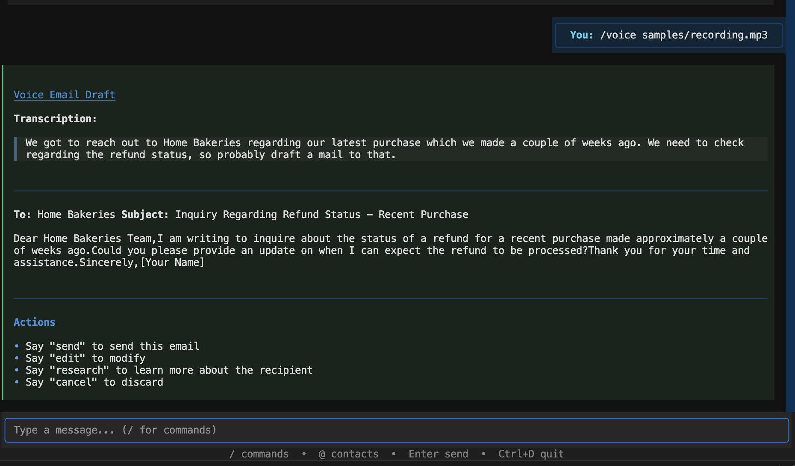
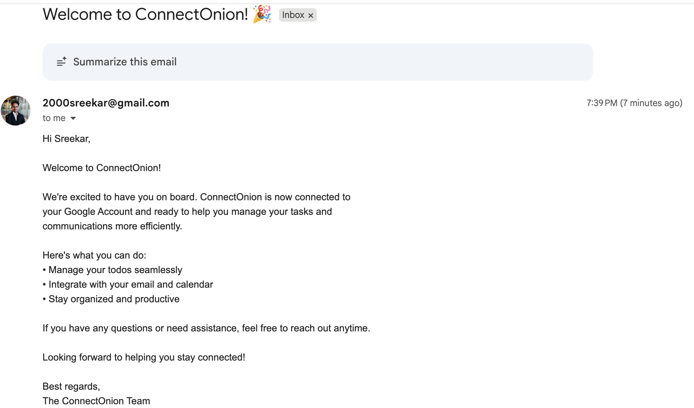

# Email Agent

AI-powered email assistant built with [ConnectOnion](https://connectonion.com).

This agent extends the standard email-agent with **unique capabilities** not found in the reference implementation.

## What Makes This Different

| Feature | Reference Agent | This Agent |
|---------|-----------------|------------|
| **Contact Intelligence** | Not available | Research contacts via web before emailing |
| **Voice Email** | Not available | Dictate emails via audio transcription |
| **Relationship Tracking** | Not available | Monitor contact engagement health |
| **Weekly Analytics** | Not available | AI-powered productivity insights |
| **Approval Workflow** | Not available | Confirmation before sending emails |
| **Email Insights Plugin** | Not available | Priority and sentiment analysis |

---

## Screenshots

### Daily Briefing
Get a prioritized view of today's emails and calendar.



### Contact Research
Research anyone before emailing them - fetches company information, suggests talking points and tone.



### Weekly Analytics
AI-powered email productivity insights with actionable recommendations.



### CRM Initialization
Build a contact database from your email history automatically.



### Email Composition
Draft and send emails with AI assistance.



### All Commands
Full command reference available via `--help`.



---

## Quick Start

```bash
# Clone and setup
git clone https://github.com/esreekarreddy/connectonion-mail-agent-demo.git
cd mailAgent
python -m venv venv
source venv/bin/activate  # Windows: venv\Scripts\activate
pip install -r requirements.txt

# Authenticate (opens browser)
co auth              # LLM provider
co auth google       # Gmail access

# Run
python cli.py interactive
```

---

## Unique Features Explained

### 1. Contact Intelligence (`/research`)

Before emailing someone you don't know well, research them:

```bash
python cli.py research ceo@stripe.com
```

The agent will:
- Fetch their company website
- Analyze company size, industry, recent news
- Suggest talking points and appropriate tone
- Cache results for future reference

**Use case:** Preparing for cold outreach or important emails.

### 2. Voice Email (`/voice`)

Dictate emails while on the go:

```bash
python cli.py voice meeting_notes.mp3 --to boss@company.com
```

The agent will:
- Transcribe audio using Gemini
- Extract recipient and intent
- Research the recipient if corporate
- Generate a polished email draft

**Use case:** Capturing ideas while walking, driving, or between meetings.



### 3. Relationship Tracking (`/relationships`)

Monitor your contact engagement health:

```bash
python cli.py relationships
```

Shows contacts categorized by last interaction:
- **Critical** (>14 days) - Need immediate attention
- **Warning** (7-14 days) - Follow up soon
- **Healthy** (<7 days) - Recently contacted

**Use case:** Never let important relationships go cold.

### 4. Weekly Analytics (`/weekly`)

Get AI-powered productivity insights:

```bash
python cli.py weekly
```

Shows:
- Emails received, sent, and unread this week
- AI recommendation based on patterns

**Use case:** Weekly review of email productivity.

---

## All Commands

### Email Operations
```bash
python cli.py inbox                    # Recent emails
python cli.py inbox -n 20 --unread     # 20 unread emails
python cli.py search "from:boss"       # Search with Gmail syntax
python cli.py today                    # Daily briefing
python cli.py show <email_id>          # View full email
python cli.py archive <email_id>       # Archive email
python cli.py star <email_id>          # Star email
```

### Unique Features
```bash
python cli.py research alice@acme.com  # Research contact
python cli.py voice memo.mp3           # Dictate email
python cli.py relationships            # Contact health
python cli.py weekly                   # Email analytics
```

### CRM
```bash
python cli.py init-crm                 # Build contact database
python cli.py contacts                 # View contacts
```

### Calendar
```bash
python cli.py calendar                 # Upcoming events
python cli.py free                     # Find free slots
```

### Interactive Mode
```bash
python cli.py interactive              # TUI with slash commands
```

---

## Interactive Mode

The interactive mode provides a rich TUI with:
- Slash command autocomplete (`/`)
- Contact mention autocomplete (`@`)
- Natural language chat with the AI

Type `/help` in interactive mode to see all available commands.

---

## How It Works

### Architecture

```
User Input → CLI/TUI → Agent → Tools → Gmail/Calendar/Web
                         ↓
                      Plugins (approval, insights, visibility)
                         ↓
                      Memory (persistent context)
```

### Tools Used
- **Gmail** - Read, search, send, archive emails
- **GoogleCalendar** - View events, find free slots
- **WebFetch** - Research contacts via company websites
- **Memory** - Persistent storage for context and CRM data
- **Shell** - System commands
- **transcribe()** - Audio to text for voice email

### Custom Plugins
1. **Approval Workflow** - Requires confirmation before sending



2. **Email Insights** - Analyzes priority and sentiment
3. **Agent Visibility** - Shows workflow summaries

---

## Project Structure

```
mailAgent/
├── cli.py              # Entry point
├── agent.py            # Agent with unique tools
├── main.py             # HTTP server for deployment
├── plugins/            # Custom ConnectOnion plugins
│   ├── approval_workflow.py
│   ├── email_insights.py
│   └── agent_visibility.py
├── cli/                # CLI commands and TUI
│   ├── commands.py     # Typer CLI commands
│   ├── core.py         # Core logic functions
│   ├── interactive.py  # TUI implementation
│   └── setup.py        # Auth and setup checks
├── prompts/            # System prompts
│   ├── agent.md        # Main agent instructions
│   └── crm_init.md     # CRM initialization
├── screenshots/        # Documentation screenshots
├── samples/            # Voice demo audio files
├── data/               # Runtime data (gitignored)
└── tests/              # Test suite
```

---

## Testing

```bash
# Run all tests
pytest tests/ -v

# Current status: 33 passed, 2 skipped
```

---

## Authentication

The agent requires two authentications:

### 1. OpenOnion (LLM Provider)
```bash
co auth
```
Provides access to managed LLM APIs with free credits.

### 2. Google OAuth (Gmail + Calendar)
```bash
co auth google
```
Grants permissions for Gmail read/send/modify and Calendar access.

Credentials are stored in `.env` (gitignored).

---

## Security

- All data stays in your Gmail
- No external database
- OAuth tokens stored locally
- Personal data in `data/` folder is gitignored

---

## License

Apache 2.0

---

Built with [ConnectOnion](https://connectonion.com)
